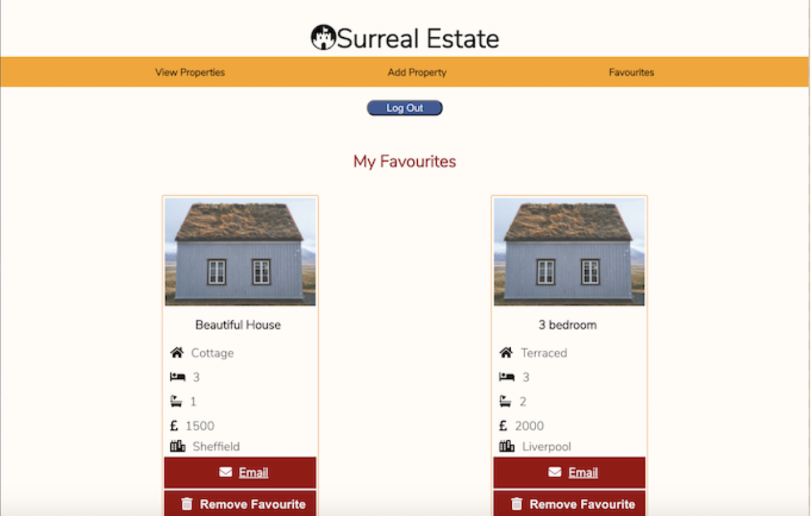
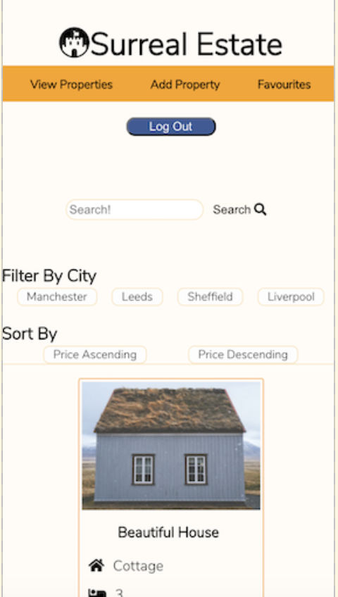

# Surreal Estate

I have created a property search Engine like Rightmove or Zoopla. The web app has a property page, a favourite page and an add property option.
You are able to log in with your facebook account as well. Once you logged in you are able to add favourites and remove them from your list as well.

## Design
On Computer and Mobile:




### Built with

+ React
+ [AirBnb Style Guide](https://airbnb.io/javascript/)

### Testing

+ [Jest](https://www.npmjs.com/package/jest)
+ [React Testing Library](https://testing-library.com/docs/react-testing-library/intro)

### Used Packages 
+ [Axios](https://www.npmjs.com/package/axios)
+ [Prettier](https://www.npmjs.com/package/prettier)
+ [PropTypes](https://www.npmjs.com/package/prop-types)
+ [FontAwesome](https://fontawesome.com/how-to-use/on-the-web/using-with/react) 

## Run the App

Clone the repository to your computer:

`https://github.com/szabinakov/surreal-estate.git`

Change directories:

`cd surreal-estate`

Install and start npm:
````
npm install
npm start
````

### Author
Szabina Kovacs 
